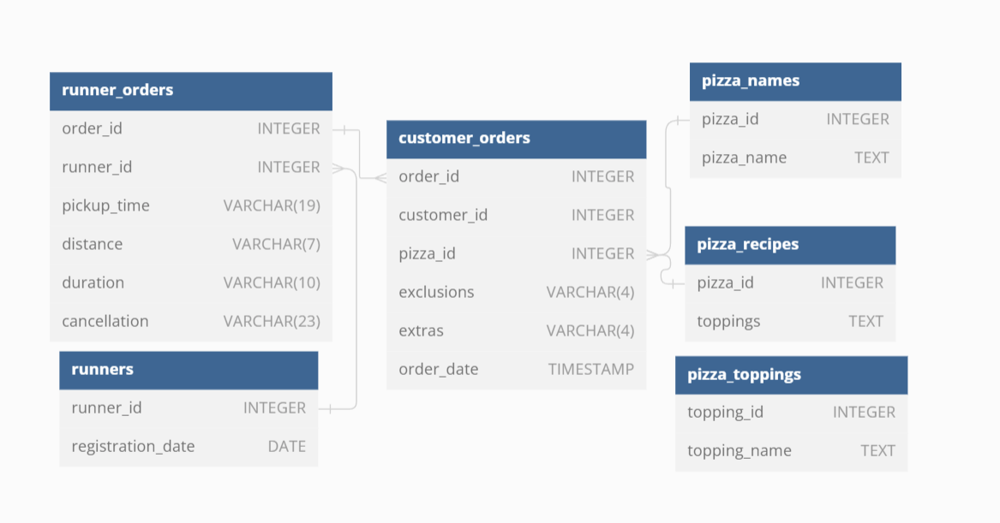

# Case Study 2 - Pizza Runner
All information for this case study can be found here - [Pizza Runner Case Study](https://8weeksqlchallenge.com/case-study-2/)


In this case study, I'll be leveraging a local PostgreSQL database to execute queries and derive insights from the following datasets:


This case study has several questions which will be divided into the following sections:

1. **Pizza Metrics**
2. **Runner and Customer Experience**
3. **Ingredient Optimization**
4. **Pricing and Ratings**
5. **Bonus Data Manipulation Language Question**

However, before we dive into the data, we have to clean up the `customer_orders` and `runner_orders` tables.

### Data Cleaning

There are two issues with the `customer_order` table

1. Exclusions column contains the string 'null' as a text value.
2. Extras column also contains the string 'null' as well as the SQL NULL for missing or undefined value.

| order\_id | customer\_id | pizza\_id | exclusions | extras | order\_time |
| :--- | :--- | :--- | :--- | :--- | :--- |
| 1 | 101 | 1 |  |  | 2020-01-01 18:05:02.000000 |
| 2 | 101 | 1 |  |  | 2020-01-01 19:00:52.000000 |
| 3 | 102 | 1 |  |  | 2020-01-02 23:51:23.000000 |
| 3 | 102 | 2 |  | null | 2020-01-02 23:51:23.000000 |
| 4 | 103 | 1 | 4 |  | 2020-01-04 13:23:46.000000 |
| 4 | 103 | 1 | 4 |  | 2020-01-04 13:23:46.000000 |
| 4 | 103 | 2 | 4 |  | 2020-01-04 13:23:46.000000 |
| 5 | 104 | 1 | null | 1 | 2020-01-08 21:00:29.000000 |
| 6 | 101 | 2 | null | null | 2020-01-08 21:03:13.000000 |
| 7 | 105 | 2 | null | 1 | 2020-01-08 21:20:29.000000 |
| 8 | 102 | 1 | null | null | 2020-01-09 23:54:33.000000 |
| 9 | 103 | 1 | 4 | 1, 5 | 2020-01-10 11:22:59.000000 |
| 10 | 104 | 1 | null | null | 2020-01-11 18:34:49.000000 |
| 10 | 104 | 1 | 2, 6 | 1, 4 | 2020-01-11 18:34:49.000000 |


To clean the data, we can simply use a CASE statement to find and replace 'null' string and SQL NULL with an empty string.

- Backup `customer_orders` table

> ```sql
> CREATE TABLE customer_orders_backup AS TABLE customer_orders;
> 
> ```

- Create and clean temporary table

> ```sql
> CREATE TABLE cleaned_customer_orders AS
> SELECT order_id,
>        customer_id,
>        pizza_id,
>        CASE
>            WHEN exclusions = 'null' OR exclusions = '' THEN ''
>            ELSE exclusions
>        END AS exclude,
>        CASE
>            WHEN extras = 'null' OR extras = '' OR extras IS NULL THEN ''
>            ELSE extras
>        END AS extra,
>        order_time
> FROM customer_orders;
> 
> ```

- Update `customer_orders` table

> ```sql
> UPDATE customer_orders
> SET exclusions = cleaned_customer_orders.exclude,
>     extras = cleaned_customer_orders.extra
> FROM cleaned_customer_orders
> WHERE customer_orders.order_id = cleaned_customer_orders.order_id;
> 
> ```

- Drop temporary table

> ```sql
> DROP TABLE cleaned_customer_orders;
> 
> ```

```sql
### A. Pizza Metrics

1. **How many pizzas were ordered?**
2. **How many unique customer orders were made?**
3. **How many successful orders were delivered by each runner?**
4. **How many of each type of pizza was delivered?**
5. **How many Vegetarian and Meatlovers were ordered by each customer?**
6. **What was the maximum number of pizzas delivered in a single order?**
7. **For each customer, how many delivered pizzas had at least 1 change and how many had no changes?**
8. **How many pizzas were delivered that had both exclusions and extras?**
9. **What was the total volume of pizzas ordered for each hour of the day?**
10. **What was the volume of orders for each day of the week?**

### B. Runner and Customer Experience

1. **How many runners signed up for each 1 week period? (i.e. week starts 2021-01-01)**
2. **What was the average time in minutes it took for each runner to arrive at the Pizza Runner HQ to pickup the order?**
3. **Is there any relationship between the number of pizzas and how long the order takes to prepare?**
4. **What was the average distance travelled for each customer?**
5. **What was the difference between the longest and shortest delivery times for all orders?**
6. **What was the average speed for each runner for each delivery and do you notice any trend for these values?**
7. **What is the successful delivery percentage for each runner?**

### C. Ingredient Optimisation

1. **What are the standard ingredients for each pizza?**
2. **What was the most commonly added extra?**
3. **What was the most common exclusion?**
4. **Generate an order item for each record in the customers_orders table in the format of one of the following:**
    - `Meat Lovers`
    - `Meat Lovers - Exclude Beef`
    - `Meat Lovers - Extra Bacon`
    - `Meat Lovers - Exclude Cheese, Bacon - Extra Mushroom, Peppers`
5. **Generate an alphabetically ordered comma separated ingredient list for each pizza order from the customer_orders table and add a 2x in front of any relevant ingredients**
    - For example: `"Meat Lovers: 2xBacon, Beef, ... , Salami"`
6. **What is the total quantity of each ingredient used in all delivered pizzas sorted by most frequent first?**

### D. Pricing and Ratings

1. **If a Meat Lovers pizza costs \$12 and Vegetarian costs \$10 and there were no charges for changes - how much money has Pizza Runner made so far if there are no delivery fees?**
2. **What if there was an additional $1 charge for any pizza extras?**
    - Add cheese is $1 extra
3. **The Pizza Runner team now wants to add an additional ratings system that allows customers to rate their runner, how would you design an additional table for this new dataset - generate a schema for this new table and insert your own data for ratings for each successful customer order between 1 to 5.**
4. **Using your newly generated table - can you join all of the information together to form a table which has the following information for successful deliveries?**
    - customer_id
    - order_id
    - runner_id
    - rating
    - order_time
    - pickup_time
    - Time between order and pickup
    - Delivery duration
    - Average speed
    - Total number of pizzas
5. **If a Meat Lovers pizza was $12 and Vegetarian $10 fixed prices with no cost for extras and each runner is paid $0.30 per kilometre traveled - how much money does Pizza Runner have left over after these deliveries?**

### E. Bonus Questions

1. **If Danny wants to expand his range of pizzas - how would this impact the existing data design? Write an INSERT statement to demonstrate what would happen if a new Supreme pizza with all the toppings was added to the Pizza Runner menu?**
